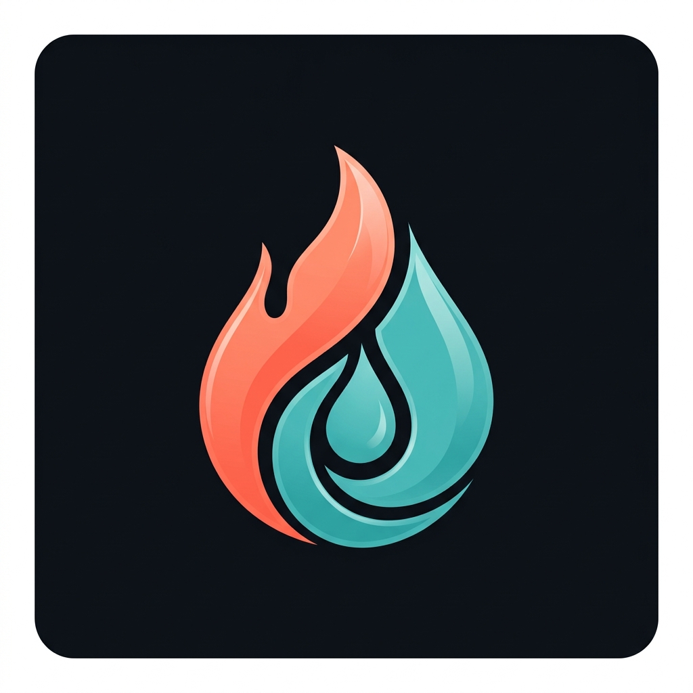

<div align="center">



<br/>

# 🌿 Vitalis
### Personal Calorie, Water & Sleep Tracker

**Privacy-first &nbsp;·&nbsp; 100% Offline &nbsp;·&nbsp; On-Device AI &nbsp;·&nbsp; Android**

[](https://flutter.dev)
[](https://dart.dev)
[](https://developer.android.com)
[](pubspec.yaml)

<br/>

> *Track calories, hydration, sleep, and activity in one beautiful glassmorphic interface — entirely on your device. No cloud. No subscriptions. No rate limits.*

<br/>

</div>

---

## 📋 Table of Contents

- [Overview](#-overview)
- [Features](#-features)
- [Architecture](#-architecture)
- [Tech Stack](#%EF%B8%8F-tech-stack)
- [Getting Started](#-getting-started)
- [Project Structure](#-project-structure)
- [AI Engine](#-on-device-ai-engine)
- [Data & Privacy](#-data--privacy)
- [Testing](#-testing)

---

## 🌟 Overview

**Vitalis** is a holistic personal health companion built with Flutter for Android. It unifies nutrition logging, smart hydration tracking, circadian sleep analytics, and real-time activity sensing into a single cohesive experience — styled with a premium iOS-inspired frosted-glass design system and full **Dark & Light mode** support driven by system brightness.

Every computation — from BMR/TDEE calculations to AI-generated health narratives — runs fully on-device via Android NNAPI and TFLite. Your health data never leaves your device.

---

## ✨ Features

### 🍽️ Smart Tiered Nutrition Tracking

Vitalis resolves food data across a **4-tier cascade**, maximising speed and offline coverage:

| Priority | Source | Description |
|----------|--------|-------------|
| **1st** | User History & Custom Recipes | Instant retrieval from local Drift SQLite |
| **2nd** | ICMR-NIN Indian Food DB | Bundled offline dataset — South Indian & Kerala dishes |
| **3rd** | Open Food Facts API | Barcode scanning & global packaged foods |
| **4th** | USDA FoodData Central API | Scientific macro/micronutrient data for raw ingredients |

- **Live Macro Rings** — Real-time visual breakdown of Calories, Protein, Carbs & Fat via animated `CircularProgressRing`
- **Custom Recipe Builder** — Save and reuse multi-ingredient dish templates with `add_custom_food_sheet`
- **Quick Add** — Fast calorie entry via `quick_add_food_sheet` without a full search
- **Barcode Scanner** — Scan packaged food barcodes for instant nutritional lookup
- **Shimmer Loading States** — Polished skeleton screens during data fetch

---

### 💧 Weather-Aware Dynamic Hydration

Hydration targets adapt to your local environment in real time:

- **Open-Meteo Integration** *(free, zero-auth)* — Fetches ambient temperature and humidity
- **Dynamic Scaling** — Target automatically adjusts +300 ml to +500 ml on hot/humid days
- **Quick Log Controls** — One-tap +250 ml, +500 ml, and fully custom entry
- **Water History Sheet** — Browse and delete past water log entries
- **Progress Visualisation** — Animated circular ring with daily percentage completion

---

### 🌙 Circadian Sleep Analytics

- **Active Sleep Tracker** — Dedicated live tracking screen with wakelock to keep display on during sessions
- **Midnight-Safe Timestamp Engine** — Correctly handles sessions crossing midnight without boundary bugs
- **Trend Charts** — Interactive 7-day and 30-day sleep history with `fl_chart` and a `SegmentedControl` range picker
- **Android Health Connect Sync** — Direct on-device sync with smartwatches and wearable sleep records
- **Evening Wind-Down Reminders** — Configurable local notifications for bedtime preparation

---

### 🧠 On-Device AI Health Engine

Zero network calls. Zero cloud dependency. All intelligence runs locally:

```
Tier A  →  Pure Dart deterministic rule templates     (always available)
Tier B  →  Multi-factor vitality & recovery scorer    (0–100 balance score)
Tier C  →  On-device TFLite NPU narration             (contextual daily insights)
```

- **Hardware-Accelerated** via Android NNAPI / MediaTek APU
- **Capability-Gated** — Falls back gracefully through tiers if NPU is unavailable
- **Daily Balance Score** — Composite metric combining nutrition, hydration, and sleep quality

---

### ⚙️ Profile, Settings & Data Management

All accessible from the **More** tab:

- **Profile Setup & Edit** — Name, age, weight, height, activity level, and fitness goal via `edit_profile_sheet`
- **BMR/TDEE Calculation** — Mifflin-St Jeor personalised calorie targets computed on-device
- **JSON Backup & Restore** — One-tap full database export/import via OS Share Sheet using `file_picker`
- **Android Health Connect** — Sync nutrition, hydration, and sleep data back to the system health store
- **Notification Controls** — Toggle and configure wind-down and hydration reminder schedules
- **Demo Data Injector** — Seed realistic sample data for testing and onboarding

---

### 🎨 Design System

A custom iOS-inspired component library under `lib/ui/design_system/`:

| Component | Purpose |
|-----------|---------|
| `AppScaffold` | Full-bleed edge-to-edge scaffold with glassmorphic background |
| `GlassContainer` | Frosted-glass card with blur, opacity, and border radius tokens |
| `CircularProgressRing` | Animated arc ring for macro and hydration progress |
| `AppButton` | Branded primary, secondary, and destructive button variants |
| `AppTextField` | Styled input with label, hint, and validation states |
| `BottomSheetModal` | Consistent modal sheet wrapper with drag handle |
| `SegmentedControl` | iOS-style pill toggle for chart range selection |
| `SwipeToDeleteRow` | Swipe-to-dismiss list row with haptic confirmation |
| `EmptyState` | Illustrated empty state widget with action CTA |
| `AppTypography` | Predefined text styles — Inter via Google Fonts |
| `AppColors` | Light & dark semantic colour tokens |

---

## 🏗️ Architecture

Vitalis follows a **clean layered architecture** with unidirectional data flow:

```
┌────────────────────────────────────────────────────────┐
│                       UI Layer                         │
│  Glassmorphic screens · Custom Design System           │
│  Dark/Light auto-theme · Edge-to-edge system UI        │
└─────────────────────┬──────────────────────────────────┘
                      │  Riverpod Providers
┌─────────────────────▼──────────────────────────────────┐
│                    Domain Layer                        │
│  Food Providers · Insights Engine · Profile Provider   │
│  Sleep Domain · Shared Preferences Provider            │
└─────────────────────┬──────────────────────────────────┘
                      │  Repositories & Services
┌─────────────────────▼──────────────────────────────────┐
│                     Data Layer                         │
│  Drift SQLite · Health Connect · REST APIs · TFLite    │
│  JSON Backup · Debug/Demo Injector · Notifications     │
└────────────────────────────────────────────────────────┘
```

---

## 🛠️ Tech Stack

| Category | Technology |
|----------|-----------|
| **Framework** | Flutter (Dart) — Android primary target |
| **State Management** | Riverpod 2.x / 3.x |
| **Local Database** | Drift (SQLite) with reactive streams |
| **AI / ML** | `tflite_flutter` — NPU/NNAPI accelerated |
| **Health Data** | Android Health Connect (`health` v13) |
| **Charts** | `fl_chart` |
| **Typography** | Google Fonts — Inter |
| **Notifications** | `flutter_local_notifications` + `timezone` |
| **HTTP** | Dart `http` — Open Food Facts, USDA, Open-Meteo |
| **Activity Sensing** | `activity_recognition_flutter` + `sensors_plus` |
| **Screen Continuity** | `wakelock_plus` |
| **Loading States** | `shimmer` |
| **File I/O** | `file_picker` · `path_provider` |
| **Preferences** | `shared_preferences` |
| **Deep Links** | `url_launcher` |
| **Code Generation** | `drift_dev` + `build_runner` |

---

## 🚀 Getting Started

### Prerequisites

- **Flutter SDK** `>=3.2.0`
- **Dart SDK** `>=3.2.0 <4.0.0`
- **Android Studio** or **VS Code** with the Flutter extension
- **Android device** — minSdk 26+

> **Recommended:** A physical Android device with a Qualcomm, MediaTek Dimensity, or Google Tensor chipset for full NPU/NNAPI acceleration.

### Installation

```bash
# 1. Clone the repository
git clone https://github.com/zack005-design/vitalis.git
cd vitalis

# 2. Install Flutter dependencies
flutter pub get

# 3. Run Drift code generator (required after any schema change)
dart run build_runner build --delete-conflicting-outputs

# 4. Run on a connected device
flutter run
```

> **Note:** An emulator will work but NPU/NNAPI acceleration will fall back to CPU inference.

---

## 📁 Project Structure

```
lib/
├── main.dart                          # App entry, theme setup, edge-to-edge UI
├── data/
│   ├── debug/                         # Demo data injector for onboarding & testing
│   ├── export/                        # JSON backup & restore service
│   ├── food/                          # Food repository: USDA, OpenFoodFacts, INDB
│   ├── health/                        # Android Health Connect client
│   ├── local/
│   │   ├── app_database.dart          # Drift database definition
│   │   ├── app_database.g.dart        # Generated Drift code
│   │   └── tables/                    # Table & DAO definitions
│   └── sleep/                         # Sleep data repository
├── domain/
│   ├── food/
│   │   └── food_providers.dart        # Food search & state providers
│   ├── insights/
│   │   ├── tier_a_rule_engine.dart    # Deterministic Dart rule templates
│   │   ├── tier_b_balance_scorer.dart # 0-100 vitality balance scorer
│   │   └── tier_c_gemini_narrator.dart# TFLite NPU narration engine
│   ├── profile/                       # User profile state & BMR/TDEE logic
│   ├── sleep/                         # Sleep domain providers
│   └── shared_preferences_provider.dart
├── services/
│   ├── notification_service.dart      # Wind-down & hydration reminders
│   └── weather_hydration_service.dart # Open-Meteo dynamic target scaling
└── ui/
    ├── design_system/                 # Full custom component library (11 components)
    ├── food/
    │   ├── food_screen.dart           # Nutrition dashboard
    │   ├── food_search_sheet.dart     # Tiered search with barcode
    │   ├── add_custom_food_sheet.dart # Custom food & recipe builder
    │   └── quick_add_food_sheet.dart  # Fast calorie entry
    ├── insights/
    │   └── insights_screen.dart       # AI vitality score & daily insights
    ├── more/
    │   ├── more_screen.dart           # Settings, export, Health Connect, notifications
    │   └── edit_profile_sheet.dart    # Profile editor
    ├── sleep/
    │   ├── sleep_screen.dart          # Sleep dashboard & fl_chart trends
    │   ├── log_sleep_sheet.dart       # Manual sleep entry
    │   └── active_sleep_tracker_screen.dart # Live sleep tracking with wakelock
    ├── today/
    │   ├── today_screen.dart          # Main dashboard — calories, water, quick logs
    │   └── water_history_sheet.dart   # Water log history & deletion
    └── main_navigation_shell.dart     # Bottom nav (Today / Food / Sleep / Insights / More)

assets/
├── data/
│   └── indb_kerala_foods.json         # Bundled ICMR-NIN offline food dataset
├── icon/
│   └── app_icon.jpg                   # App launcher icon
└── models/
    └── health_narrator.tflite         # Quantised TFLite AI narration model
```

---

## 🤖 On-Device AI Engine

The AI insights module operates on a **3-tier capability cascade**:

### Tier A — Deterministic Rules *(Always Available)*
Pure Dart logic with zero ML dependencies. Generates structured health tips from threshold comparisons — calories vs. TDEE, sleep duration vs. target, hydration rate vs. adjusted goal.

### Tier B — Balance Scorer *(CPU Fallback)*
Produces a **0–100 Vitality Score** combining:
- Calorie adherence (vs. personalised TDEE)
- Hydration rate (vs. weather-adjusted target)
- Sleep quality (duration, consistency, and timing)

### Tier C — TFLite Narration *(NPU/NNAPI Gated)*
A quantised TFLite model (`health_narrator.tflite`) running on the device NPU that generates **contextual, natural-language daily summaries** — entirely on-chip, zero network calls. Automatically falls back to Tier A if NPU acceleration is unavailable.

---

## 🔐 Data & Privacy

Vitalis was built **privacy-first, local-first** from day one:

- ✅ **No account required** — zero sign-up, zero sign-in
- ✅ **No network telemetry** — no analytics SDKs or crash reporters
- ✅ **No paid APIs** — all external APIs are free and require no authentication
- ✅ **Full data portability** — export your entire database as JSON at any time
- ✅ **Health Connect** — writes health records to the Android system store; you stay in full control
- ✅ **On-device AI only** — no prompts or personal data ever sent to a remote model

---

## 🧪 Testing

```bash
# Run all unit & widget tests
flutter test

# Run with verbose output
flutter test --reporter=expanded

# Run a specific test
flutter test test/bmr_calculator_test.dart
```

| Test File | What It Covers |
|-----------|---------------|
| `bmr_calculator_test.dart` | Mifflin-St Jeor BMR/TDEE accuracy |
| `female_bmr_and_design_system_test.dart` | Female profile calculations & design tokens |
| `sleep_timestamp_test.dart` | Core sleep timestamp logic |
| `midnight_rollover_and_sleep_range_test.dart` | Midnight-boundary edge cases & range queries |
| `validation_and_water_target_test.dart` | Input validation & dynamic hydration scaling |
| `json_backup_service_test.dart` | JSON export/import serialisation integrity |
| `health_connect_client_test.dart` | Health Connect read/write operations |
| `notification_service_test.dart` | Notification scheduling & cancellation |
| `api_and_npu_integration_test.dart` | REST API fallback & TFLite NPU capability detection |
| `accessibility_and_polish_test.dart` | Accessibility semantics & UI polish checks |
| `pop_scope_and_profile_sync_test.dart` | Profile sync & back-navigation behaviour |
| `circular_progress_ring_test.dart` | Progress ring widget rendering |

---

<div align="center">

Built with ❤️ using Flutter &nbsp;·&nbsp; Powered by on-device intelligence &nbsp;·&nbsp; Zero cloud, zero compromise

</div>
